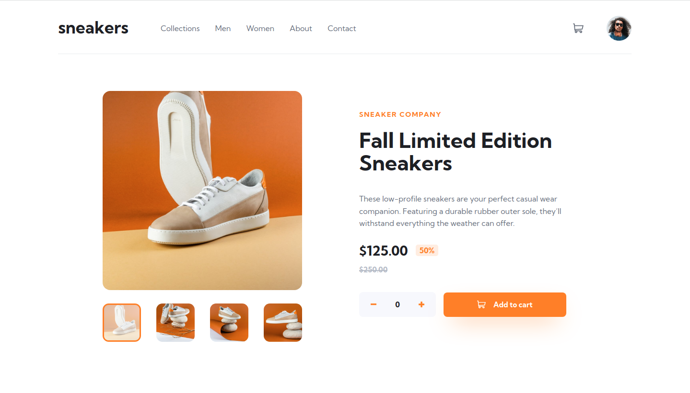
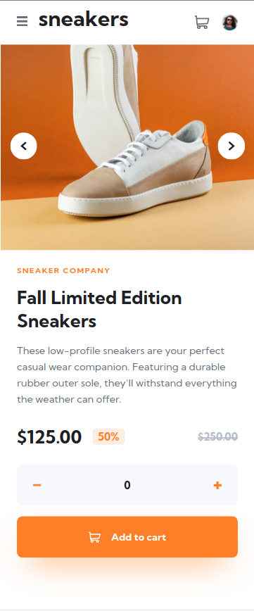

# Frontend Mentor - E-commerce product page solution

This is a solution to the [E-commerce product page challenge on Frontend Mentor](https://www.frontendmentor.io/challenges/ecommerce-product-page-UPsZ9MJp6).

## Table of contents

- [Overview](#overview)
  - [The challenge](#the-challenge)
  - [Screenshot](#screenshot)
  - [Links](#links)
- [My process](#my-process)
  - [Built with](#built-with)
  - [What I learned](#what-i-learned)
  - [Useful resources](#useful-resources)
- [Author](#author)

## Overview

### The challenge

Users should be able to:

- View the optimal layout for the site depending on their device's screen size
- See hover states for all interactive elements on the page
- Open a lightbox gallery by clicking on the large product image
- Switch the large product image by clicking on the small thumbnail images
- Add items to the cart
- View the cart and remove items from it

### Screenshot

### Links

- Solution URL: [Add solution URL here](https://your-solution-url.com)
- Live Site URL: [Add live site URL here](https://your-live-site-url.com)

## My process

### Built with

- Semantic HTML5 markup
- CSS custom properties
- Flexbox
- Mobile-first workflow
- JavaScript

### What I learned

- How to create a lightbox
- How to color a "svg" image using css
- Inprove my skills in mobile-first

### Useful resources

- [Kevin Powell Youtube Channel](https://www.youtube.com/watch?v=FEmysQARWFU&t=1106s) - This helped me to hover the navbar to screen bigger
- [CSS filter generator](https://codepen.io/sosuke/pen/Pjoqqp) - This helped me color the "svg" images through filters
- [Web Dev Simplified Channel](https://www.youtube.com/watch?v=uKVVSwXdLr0) - This helped me to understand how i can make a lightbox

## Author

- Linkedin- [Gabriel Pinheiro](https://www.linkedin.com/feed/)
- Frontend Mentor - [@GabrielFMPinheiro](https://www.frontendmentor.io/profile/GabrielFMPinheiro)
- Codewars - [@GabrielFMPinheiro](https://www.codewars.com/users/GabrielFMPinheiro)
